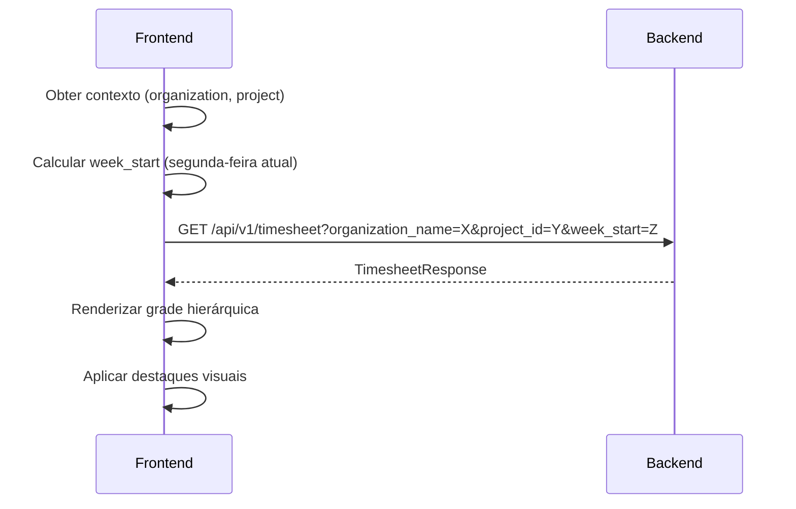
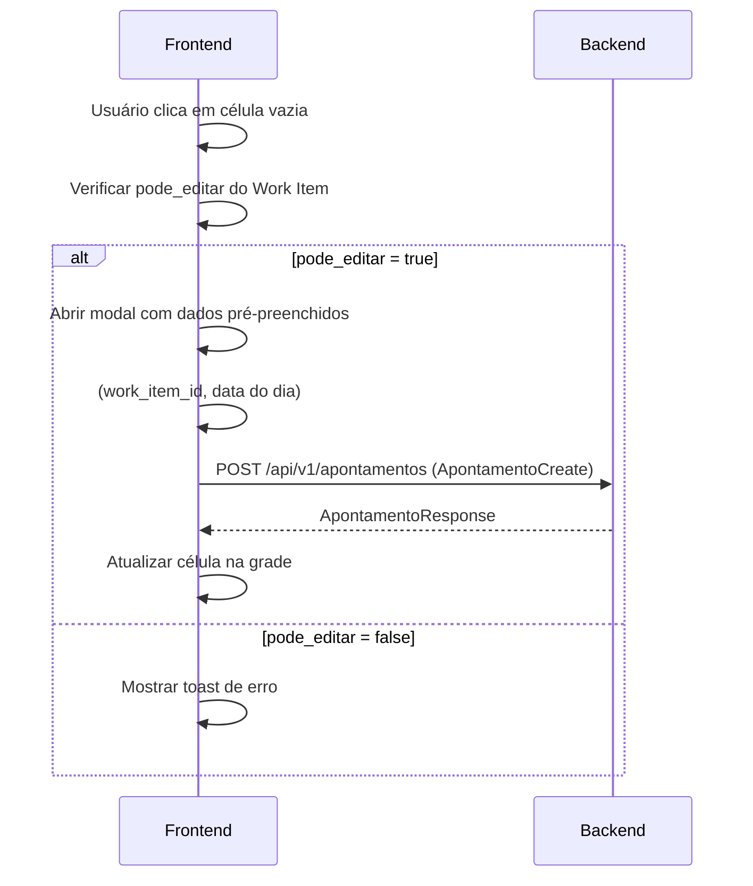
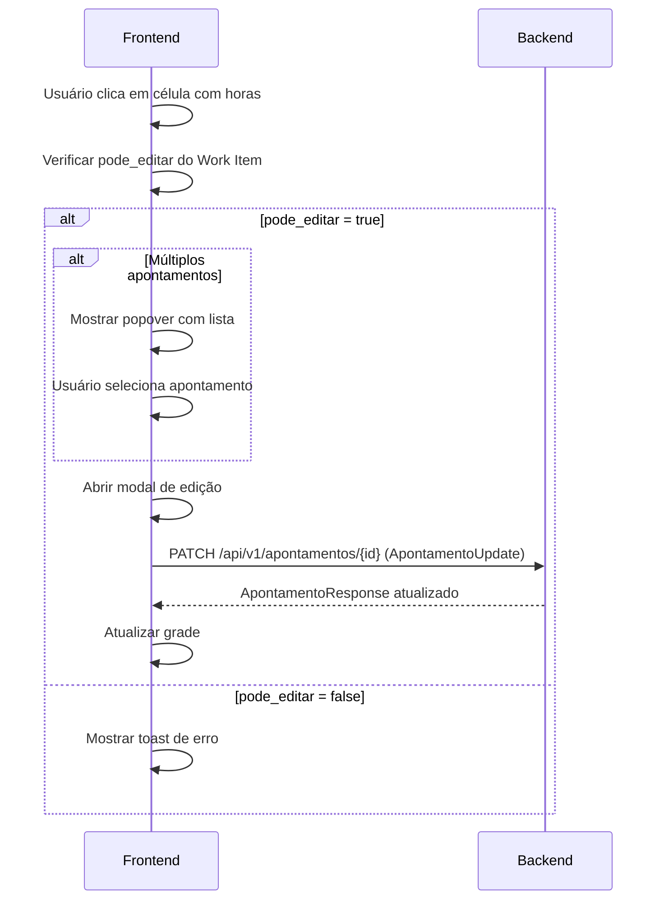
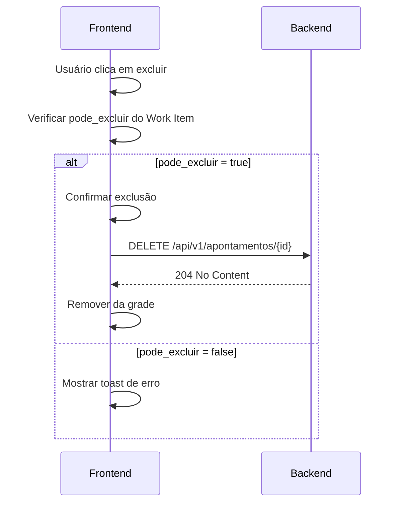

# Implementação do Frontend - Timesheet (Folha de Horas)

## 📋 Resumo

Este documento contém todas as informações necessárias para implementar a **página de Gestão de Apontamentos (Timesheet/Folha de Horas)** no frontend. O backend já expõe os endpoints necessários para:

1. Obter a grade semanal hierárquica com Work Items e apontamentos
2. Verificar permissões de edição/exclusão baseadas no estado do Work Item

---

## 🎯 Objetivo

Implementar uma grade semanal (timesheet) que exiba:

- **Hierarquia de Work Items** (Epic → Feature → Story → Task/Bug)
- **Colunas E e H** (Esforço planejado e Histórico de horas)
- **7 colunas de dias** (segunda a domingo)
- **Totais por linha e por coluna**
- **Controles de edição/exclusão** respeitando o estado do Work Item

---

## 🔌 Endpoints Disponíveis

### 1. GET `/api/v1/timesheet`

Retorna a grade semanal completa com hierarquia de Work Items e apontamentos agregados.

#### Parâmetros de Query (obrigatórios)

| Parâmetro | Tipo | Descrição |
|-----------|------|-----------|
| `organization_name` | string | Nome da organização no Azure DevOps |
| `project_id` | string | ID ou nome do projeto no Azure DevOps |

#### Parâmetros de Query (opcionais)

| Parâmetro | Tipo | Default | Descrição |
|-----------|------|---------|-----------|
| `week_start` | date (YYYY-MM-DD) | semana atual | Data de início da semana (segunda-feira) |
| `only_my_items` | boolean | false | Filtrar apenas Work Items atribuídos ao usuário logado |

#### Exemplo de Request

```http
GET /api/v1/timesheet?organization_name=minha-org&project_id=meu-projeto&week_start=2026-01-19&only_my_items=true
Authorization: Bearer <token>
```

#### Exemplo de Response

```json
{
  "semana_inicio": "2026-01-19",
  "semana_fim": "2026-01-25",
  "semana_label": "19/01 - 25/01",
  "work_items": [
    {
      "id": 1001,
      "title": "Epic - Sistema de Apontamentos",
      "type": "Epic",
      "state": "Active",
      "state_category": "InProgress",
      "icon_url": "https://dev.azure.com/...",
      "assigned_to": "João Silva",
      "original_estimate": 100.0,
      "completed_work": 45.5,
      "remaining_work": 54.5,
      "total_semana_horas": 8.5,
      "total_semana_formatado": "08:30",
      "nivel": 0,
      "parent_id": null,
      "pode_editar": true,
      "pode_excluir": true,
      "dias": [
        {
          "data": "2026-01-19",
          "dia_semana": "seg",
          "dia_numero": 19,
          "total_horas": 2.0,
          "total_formatado": "02:00",
          "eh_hoje": true,
          "eh_fim_semana": false,
          "apontamentos": [
            {
              "id": "a1b2c3d4-...",
              "duracao": "02:00",
              "duracao_horas": 2.0,
              "id_atividade": "uuid-atividade",
              "atividade_nome": "Desenvolvimento",
              "comentario": "Implementação do módulo X"
            }
          ]
        },
        {
          "data": "2026-01-20",
          "dia_semana": "ter",
          "dia_numero": 20,
          "total_horas": 0,
          "total_formatado": "",
          "eh_hoje": false,
          "eh_fim_semana": false,
          "apontamentos": []
        }
        // ... mais 5 dias
      ],
      "children": [
        {
          "id": 1002,
          "title": "Feature - Módulo de Cadastro",
          "type": "Feature",
          "nivel": 1,
          "parent_id": 1001,
          // ... mesma estrutura
          "children": [
            {
              "id": 1003,
              "title": "US - Cadastro de Usuários",
              "type": "User Story",
              "nivel": 2,
              "parent_id": 1002,
              "children": [
                {
                  "id": 1004,
                  "title": "Task - Criar formulário",
                  "type": "Task",
                  "nivel": 3,
                  "parent_id": 1003,
                  "children": []
                }
              ]
            }
          ]
        }
      ]
    }
  ],
  "total_geral_horas": 42.5,
  "total_geral_formatado": "42:30",
  "totais_por_dia": [
    {
      "data": "2026-01-19",
      "dia_semana": "seg",
      "dia_numero": 19,
      "total_horas": 8.0,
      "total_formatado": "08:00",
      "eh_hoje": true
    }
    // ... 6 dias restantes
  ],
  "total_work_items": 15,
  "total_esforco": 200.0,
  "total_historico": 42.5
}
```

---

### 2. GET `/api/v1/timesheet/work-item/{work_item_id}/state-category`

Verifica a categoria de estado de um Work Item específico para determinar permissões de edição/exclusão.

#### Parâmetros de Path

| Parâmetro | Tipo | Descrição |
|-----------|------|-----------|
| `work_item_id` | integer | ID do Work Item no Azure DevOps |

#### Parâmetros de Query (obrigatórios)

| Parâmetro | Tipo | Descrição |
|-----------|------|-----------|
| `organization_name` | string | Nome da organização no Azure DevOps |
| `project_id` | string | ID ou nome do projeto no Azure DevOps |

#### Exemplo de Request

```http
GET /api/v1/timesheet/work-item/1234/state-category?organization_name=minha-org&project_id=meu-projeto
Authorization: Bearer <token>
```

#### Exemplo de Response

```json
{
  "work_item_id": 1234,
  "state": "Active",
  "state_category": "InProgress",
  "can_edit": true,
  "can_delete": true
}
```

---

## 📦 Schemas TypeScript

### TimesheetResponse

```typescript
interface TimesheetResponse {
  // Período
  semana_inicio: string;           // "2026-01-19" (YYYY-MM-DD)
  semana_fim: string;              // "2026-01-25"
  semana_label: string;            // "19/01 - 25/01"
  
  // Hierarquia de Work Items
  work_items: WorkItemTimesheet[];
  
  // Totais gerais
  total_geral_horas: number;       // 42.5
  total_geral_formatado: string;   // "42:30"
  totais_por_dia: TotalDia[];
  
  // Metadados
  total_work_items: number;
  total_esforco: number;           // Coluna E (soma)
  total_historico: number;         // Coluna H (soma)
}
```

### WorkItemTimesheet

```typescript
interface WorkItemTimesheet {
  // Identificação
  id: number;                      // ID do Work Item no Azure DevOps
  title: string;
  type: string;                    // "Epic", "Feature", "User Story", "Task", "Bug"
  state: string;                   // "New", "Active", "Resolved", "Closed"
  state_category: string;          // "Proposed", "InProgress", "Resolved", "Completed", "Removed"
  icon_url: string;
  assigned_to: string | null;
  
  // Campos de esforço
  original_estimate: number | null; // Coluna E - Esforço planejado (horas)
  completed_work: number | null;
  remaining_work: number | null;
  
  // Totais da semana
  total_semana_horas: number;      // Coluna H - Histórico
  total_semana_formatado: string;  // "08:30"
  
  // Células dos dias da semana (7 itens: seg a dom)
  dias: CelulaDia[];
  
  // Hierarquia
  nivel: number;                   // 0=Epic, 1=Feature, 2=Story, 3=Task/Bug
  parent_id: number | null;
  children: WorkItemTimesheet[];
  
  // Permissões
  pode_editar: boolean;
  pode_excluir: boolean;
}
```

### CelulaDia

```typescript
interface CelulaDia {
  data: string;                    // "2026-01-19" (YYYY-MM-DD)
  dia_semana: string;              // "seg", "ter", "qua", "qui", "sex", "sáb", "dom"
  dia_numero: number;              // 19
  total_horas: number;             // 2.5
  total_formatado: string;         // "02:30" (vazio se 0)
  apontamentos: ApontamentoDia[];
  eh_hoje: boolean;
  eh_fim_semana: boolean;
}
```

### ApontamentoDia

```typescript
interface ApontamentoDia {
  id: string;                      // UUID
  duracao: string;                 // "02:00"
  duracao_horas: number;           // 2.0
  id_atividade: string;            // UUID da atividade
  atividade_nome: string;          // "Desenvolvimento"
  comentario: string | null;
}
```

### TotalDia

```typescript
interface TotalDia {
  data: string;
  dia_semana: string;
  dia_numero: number;
  total_horas: number;
  total_formatado: string;
  eh_hoje: boolean;
}
```

### StateCategoryResponse

```typescript
interface StateCategoryResponse {
  work_item_id: number;
  state: string;
  state_category: string;
  can_edit: boolean;
  can_delete: boolean;
}
```

---

## 🎨 Estrutura Visual da Grade

```
┌────────────────────────────────────────────────────────────────────────────────────────┐
│ [< Anterior]  [Hoje]  [Próxima >]     19/01 - 25/01                                    │
├────────────────────────────────────────────────────────────────────────────────────────┤
│ Work Item                           │  E   │  H   │ Seg │ Ter │ Qua │ Qui │ Sex │ Sáb │ Dom │ Σ    │
├─────────────────────────────────────┼──────┼──────┼─────┼─────┼─────┼─────┼─────┼─────┼─────┼──────┤
│ 👑 Epic - Sistema                   │ 100h │ 42h  │ 8h  │ 6h  │ 8h  │ 8h  │ 8h  │ 2h  │ 2h  │ 42h  │
│   🏆 Feature - Módulo A             │  50h │ 20h  │ 4h  │ 4h  │ 4h  │ 4h  │ 4h  │     │     │ 20h  │
│     📘 US - Cadastro                │  20h │ 10h  │ 2h  │ 2h  │ 2h  │ 2h  │ 2h  │     │     │ 10h  │
│       📋 Task - Formulário          │   8h │  4h  │ 1h  │ 1h  │ 1h  │ 1h  │     │     │     │  4h  │
│       🐛 Bug - Validação            │   4h │  2h  │     │     │     │     │ 2h  │     │     │  2h  │
├─────────────────────────────────────┼──────┼──────┼─────┼─────┼─────┼─────┼─────┼─────┼─────┼──────┤
│ TOTAL                               │ 200h │ 42h  │ 8h  │ 6h  │ 8h  │ 8h  │ 8h  │ 2h  │ 2h  │ 42h  │
└─────────────────────────────────────┴──────┴──────┴─────┴─────┴─────┴─────┴─────┴─────┴─────┴──────┘
```

### Colunas

| Coluna | Descrição | Campo |
|--------|-----------|-------|
| **Work Item** | Título hierárquico com ícone | `title`, `type`, `nivel` |
| **E (Esforço)** | Estimativa original (horas) | `original_estimate` |
| **H (Histórico)** | Total acumulado na semana | `total_semana_horas` |
| **Seg - Dom** | Células clicáveis por dia | `dias[].total_formatado` |
| **Σ (Semanal)** | Total da linha | `total_semana_formatado` |

---

## 🎯 Regras de Negócio

### 1. Permissões de Edição/Exclusão

As permissões são baseadas na **categoria do estado** do Work Item no Azure DevOps:

| State Category | Estados | Permite Editar | Permite Excluir |
|----------------|---------|----------------|-----------------|
| **Proposed** | New | ✅ Sim | ✅ Sim |
| **InProgress** | Active, Committed, Open | ✅ Sim | ✅ Sim |
| **Resolved** | Resolved | ✅ Sim | ✅ Sim |
| **Completed** | Closed, Done | ❌ Não | ❌ Não |
| **Removed** | Removed | ❌ Não | ❌ Não |

**Implementação:**
- Use os campos `pode_editar` e `pode_excluir` que já vêm no response
- Ao clicar para editar/excluir um apontamento em Work Item bloqueado:
  - Mostre mensagem: *"Não é possível editar/excluir apontamentos de Work Items em estado Completed ou Removed"*
  - Desabilite visualmente os botões de edição/exclusão

### 2. Destaque Visual

| Condição | Estilo Sugerido |
|----------|-----------------|
| **Dia atual** (`eh_hoje: true`) | Coluna com fundo azul claro |
| **Fim de semana** (`eh_fim_semana: true`) | Coluna com fundo cinza claro |
| **Célula com apontamento** | Fundo amarelo suave (#FFF4CE) |
| **Work Item bloqueado** | Linha com opacidade reduzida (0.6) |

### 3. Interação com Células

1. **Clique em célula vazia**: Abrir modal de criação de apontamento
2. **Clique em célula com horas**: 
   - Se 1 apontamento: Abrir modal de edição
   - Se múltiplos: Mostrar popover com lista e opções

### 4. Navegação Temporal

- **Anterior/Próxima**: Ajustar `week_start` em ±7 dias
- **Hoje**: Calcular a segunda-feira da semana atual
- A `week_start` deve sempre ser uma **segunda-feira**

---

## 🔄 Fluxos de Interação

### Fluxo 1: Carregar Timesheet



### Fluxo 2: Criar Apontamento (Clique em Célula)



### Fluxo 3: Editar Apontamento



### Fluxo 4: Excluir Apontamento



---

## 📝 Endpoints de Apontamentos (Já Existentes)

Para CRUD de apontamentos, use os endpoints existentes:

### POST `/api/v1/apontamentos`

```typescript
// Request Body
interface ApontamentoCreate {
  data_apontamento: string;        // "2026-01-19"
  duracao: string;                 // "02:00"
  id_atividade: string;            // UUID da atividade
  comentario?: string;
  work_item_id: number;            // ID do Work Item
  project_id: string;              // ID do projeto
  organization_name: string;       // Nome da organização
  usuario_id: string;              // ID do usuário (contexto ADO)
  usuario_nome: string;            // Nome do usuário
  usuario_email?: string;          // Email do usuário
}
```

### PATCH `/api/v1/apontamentos/{id}`

```typescript
// Request Body
interface ApontamentoUpdate {
  data_apontamento?: string;
  duracao?: string;
  id_atividade?: string;
  comentario?: string;
}
```

### DELETE `/api/v1/apontamentos/{id}`

Retorna `204 No Content` em caso de sucesso.

---

## 🔧 Utilitários Sugeridos

### Calcular Segunda-feira da Semana

```typescript
function getMondayOfWeek(date: Date): Date {
  const d = new Date(date);
  const day = d.getDay();
  const diff = d.getDate() - day + (day === 0 ? -6 : 1);
  d.setDate(diff);
  d.setHours(0, 0, 0, 0);
  return d;
}
```

### Formatar Data para API

```typescript
function formatDateForApi(date: Date): string {
  return date.toISOString().split('T')[0]; // "2026-01-19"
}
```

### Renderizar Hierarquia Recursiva

```typescript
function renderWorkItems(items: WorkItemTimesheet[], level = 0): JSX.Element[] {
  return items.flatMap(item => [
    <WorkItemRow key={item.id} item={item} level={level} />,
    ...renderWorkItems(item.children, level + 1)
  ]);
}
```

---

## ⚠️ Pontos de Atenção

1. **Autenticação**: Todos os endpoints requerem token Bearer válido
2. **Timezone**: Datas são retornadas em UTC, converter para local no frontend
3. **Cache**: Considerar cache do timesheet por 1-2 minutos para reduzir chamadas
4. **Loading States**: Implementar skeleton loading durante carregamento
5. **Tratamento de Erros**: 
   - 401: Token expirado, redirecionar para login
   - 404: Work Item não encontrado
   - 422: Parâmetros inválidos

---

## 📚 Referências

- [ESPECIFICACAO_FRONTEND_APONTAMENTO.md](./ESPECIFICACAO_FRONTEND_APONTAMENTO.md) - Especificação visual completa
- [API_DOCUMENTATION.md](../api/API_DOCUMENTATION.md) - Documentação geral da API
- Design System: Azure DevOps + 7pace Timetracker
